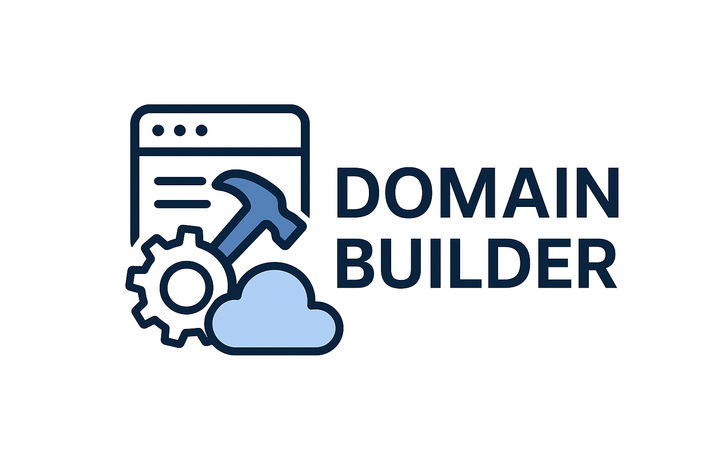
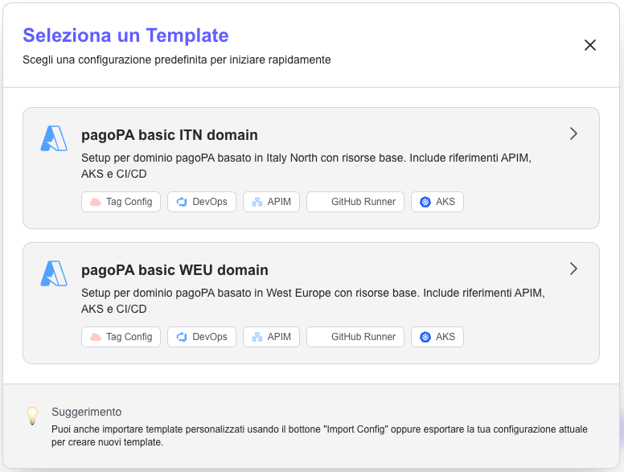
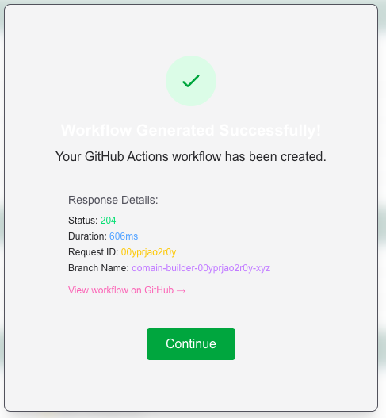
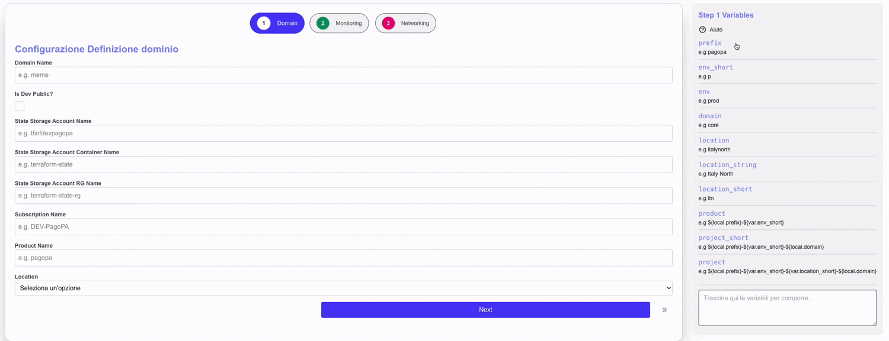

# Payment Cloud Domain Builder

<p align="center">
  
</p>

## Descrizione

Payment Cloud Domain Builder è un'applicazione che permette di definire nuovi domini applicativi in modo semplificato. 
L'applicazione fornisce un'interfaccia utente intuitiva per gestire la configurazione dei domini e  successivamente crea il branch con il nuovo dominio, per revisione e creazione PR.

## Funzionalità

### Quick start

#### Selezione template
Dalla pagina principale, cliccando sul bottone _**Quick start**_ è possibile selezionare un template da caricare per definire rapidamente un nuovo dominio. Sarà poi possibile modificare i parametri caricati, aggiungere componenti e personalizzare in generale il dominio che verrà creato

<p align="center">
  
</p>

Qui si può avere un overview dei componenti inclusi nel template ed una breve descrizione.

#### Configurazione dominio
Una volta selezionato un template, si atterra nuovamente sulla pagina principale con i valori prepopolati; si devono ora definire i valori mancanti per personalizzare il dominio.
In base al template (ed ai componenti inclusi) verranno richiesti diversi parametri, ma sicuramente deve essere definito il nome del dominio (_**Domain name**_).
Navigando tra i vari tab del wizard è possibile visionare i valori mancanti e quelli predefiniti;

Nella sezione _**Add components**_ è possibile abilitare/disabilitare i vari componenti che si vogliono includere nel dominio, permettendo cosi di configurarli, ove necessario

Una volta raggiunta l'ultima pagina, prima di procedere con la creazione del dominio, viene fornito un riepilogo della configurazione scelta, dove è possibile a colpo d'occhio visionare i componenti abilitati/disabilitati e le eventuali configurazioni mancanti 

#### Creazione dominio
Dalla schermata di riepilogo, cliccando sul bottone _**Genera dominio**_ viene avviato il processo di creazione del dominio.
Viene quindi mostrata una schermata di risposta dove è possibile trovare il nome del branch che è stato creato e monitorare l'andamento del processo di build tramite il link _View workflow on github_


<p align="center">
  
</p>


### Configurazione manuale

A differenza del quick start, è possibile configurare manualmente il dominio senza utilizzare un template predefinito; gli unici tab predefiniti sono quelli relativi al dominio stesso, al monitoraggio ed al networking, che costituiscono le componenti minime necessarie per la definizione di un dominio.
Il flusso di lavoro non prevede differenze rispetto a quello descritto nella sezione precedente:

- abilitazione dei componenti desiderati
- configurazione dei parametri richiesti
- validazione della configurazione
- generazione del dominio

### Utilità

Nella sezione di sono censite le variabili ed i locals che vengono generati dal builder per ogni dominio; ogni variabile/local utilizzabile liberamente all'interno di ogni campo di configurazione ed è possibile trascinare ogni elemento per comporre il valore desiderato
Sfruttare la text area in basso per comporre un valore complesso e riutilizzarlo tramite copia-incolla in più campi di configurazione

<p align="center">
  
</p>


### Cosa viene prodotto

L'applicazione genera un branch sul repository GitHub collegato, contenente la configurazione del dominio appena creato.
Il nome del branch segue la convenzione `domain-builder/domain-<domain_name>-<unique_id>`, e conterrà:

- i file terraform relativi ai componenti scelti in fase di configurazione 
- la cartella relativa all'ambiente di _**dev**_

Altre cartelle di ambiente, con le relative variabili, configurazione del backend devono essere create manualmente dall'utente.


## Contributing

### Definizione di nuovi componenti

#### Template jinja2
Nella cartella `src/templates` sono definiti i template in formato jinja2 che vengono utilizzati per generare i file terraform relativi ai vari componenti.
Utilizzare un singolo file per includere tutte le risorse relative ad un componente; il nome dle file **deve coincidere** (numerazione esclusa) con la variabile `include_<nome_componente>` 
utilizzata per determinare se il componente è stato attivato o meno. 
Nel file `00_data.tf` riportare i blocchi di tipo `data` necessari per il componente raccogliendoli dentro un blocco `if` sulla variabile `include_<nome_componente>`.

_es:_
```hcl 
 # jinja2 
data "azurerm_api_management" "apim" { # hcl
  name                = local.apim_name
  resource_group_name = local.apim_rg_name
}

```
Nel file `99_variables.tf` definire le variabili necessarie per la configurazione del componente, sempre racchiuse in un blocco `if` sulla variabile `include_<nome_componente>`.

_es:_ 
```hcl
 # jinja2 
variable "redis_idh_resource_tier" { # hcl
    type        = string
    description = "The IDH resource tier for the Redis cache."
}

```

Per chiarezza e facilità di manutenzione è consigliato nominare le variabili jinja2 con il prefisso `<nome_componente>_`, in modo da poterle facilmente identificare come appartenenti ad un determinato componente.

###### Elaborazione variabili
Se dovesse essere necessario effettuare delle elaborazioni sulle variabili jinja2 in input ai template per poter essere utilizzate in modo più efficace, è possibile definirle nel file `src/vars/elaborations.yml`
Utilizzare sempre il filtro `default('')` per evitare errori in caso di componente non abilitato (e quindi variabile non definita).

_es:_
```yml
<processed_variable_name>: "{{<variable_name> | default('') | lower | replace(' ', '-')}}"
```

#### Frontend

Una volta definiti i file template per il componente, è necessario censire il nuovo componente e le variabili attese nel frontend, in modo che l'utente possa abilitarlo e configurarlo.
Nella cartella `src/fe/utils` è presente il file `inputs.ts` dove sono definiti tutti i componenti disponibili e le relative variabili di configurazione.
Di seguito sono riportati il minimo di campi necessari per definire un componente:

```json
<component_name>: {
        default: false,
        name: "<Component Display Name>",
        formFields: [
          { name: "Abilita <componente>", key: "include_<component_name>", type: "hidden", value: "false" },
        ]
}
```
dove:

- `component_name`: nome del componente, in snake_case, che deve coincidere con il nome dei file jinja2 definiti in precedenza
- `name`: nome visualizzato nell'interfaccia utente
- `formFields`: array di campi di configurazione del componente; deve essere presente il campo `include_<component_name>` di tipo `hidden` per permettere l'abilitazione/disabilitazione del componente

Eventuali altri campi di input possono essere definiti seguendo la documentazione presente nel file stesso.

### Avvio dell'applicazione in locale

Setup ambiente:
```bash
cd src/fe
npm install --legacy-peer-deps
```

creare il file `.env.local` nella cartella `src/fe` con il seguente contenuto:
```env
GITHUB_TOKEN=<your github token>
```
se si vuole utilizzare l'autenticazione Google, aggiungere anche:
```env
NEXT_PUBLIC_GOOGLE_CLIENT_ID=<your google app client id>
NEXT_PUBLIC_ADMIN_PASSWORD=<your google app admin password>
```


Avvio applicazione:
```bash
npm run dev
```

l'applicazione sarà raggiungibile all'indirizzo [http://localhost:3000](http://localhost:3000)

### Esecuzione ansible in locale

Definire le variabili di configurazione del builder nel file `src/vars/local.yml`
è possibile estrarre le variabili dal frontend una volta configurato il dominio, cliccando sul tasto "Export config" e convertendo il contenuto del campo "formData" in formato yml

_es parziale:_
```yml
domain_name: "mydomain"
is_dev_public: true
storage_account_state_name: "tfinfdevpagopa"
storage_account_container_state_name: "terraform-state"
storage_account_state_rg_name: "terraform-state-rg"
subscription: "DEV-pagoPA"
[...]
```

```bash
cd src
ansible-playbook -i src/inventory/hosts domain-builder.yml --extra-vars "local_run=true"
```


